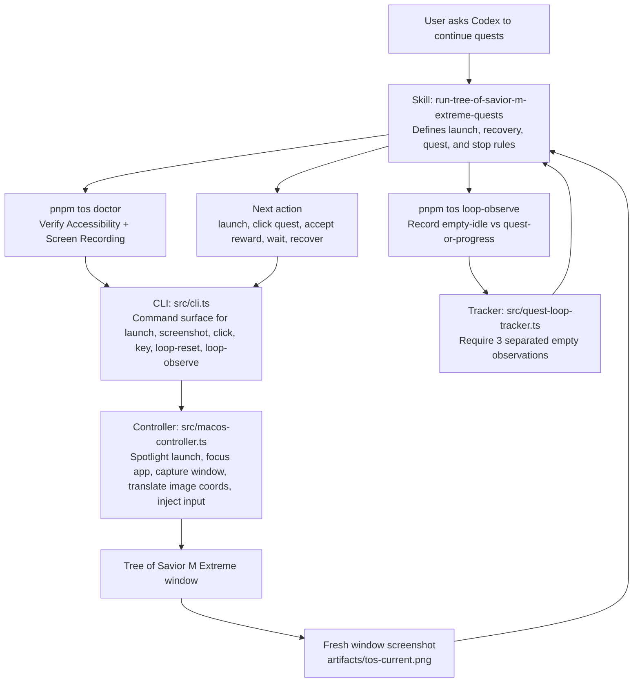

# Tree of Savior Extreme TH Mac App - AI workflow

Shared AI agent skills and harness configs for the Tree of Savior Extreme app workflow only.

## Stack

- Node.js 22
- pnpm
- ES modules
- `yargs` for the CLI
- `@inquirer/prompts` for interactive install selection

## Layout

- `skills/` - Codex skill source of truth
- `scripts/nemo.mjs` - interactive symlink installer

## Install

```bash
pnpm install
pnpm nemo symlink
```

The `nemo` command lets you choose whether to install:

- skills

Codex is available as both a project-local `.codex/skills` target and a global
`~/.codex/skills` target.
You can install into this project or into your home directory so the same skills are available across projects.

## Scope

This project only focuses on the Tree of Savior Extreme app and its related automation tasks.

Current skills:

- `launch-app-via-spotlight`
- `run-tree-of-savior-m-extreme-quests`

Each skill lives under `skills/<skill-name>/SKILL.md` and should stay specific to Tree of Savior Extreme use cases.

## Phase 1: Codex on macOS

The first phase targets the Codex desktop app and its Computer Use helper. Before
running the controller, open **System Settings > Privacy & Security** and enable
both `Codex` and `Codex Computer Use` in:

- **Accessibility** - allows keyboard and pointer control.
- **Screen & System Audio Recording** - allows screenshots and visual state
  detection. Older macOS versions may label this pane **Screen Recording**.

If Codex is running from a terminal, also enable both permissions for the host
terminal application, such as `Terminal` or `iTerm`. macOS applies these grants
to the application that launched the controller.

Quit and reopen Codex and its host terminal, when applicable, after changing
either permission so macOS applies the new grants to the running processes. Then
verify the setup from the repository root:

```bash
pnpm tos doctor
```

Continue only when the command reports both `"accessibility": true` and
`"screenRecording": true`.

## macOS Controller

The TypeScript controller provides the low-level interface used by the game loop:

```bash
pnpm tos launch
pnpm tos screenshot artifacts/tos-screen.png
pnpm tos click 640 420
pnpm tos window-screenshot artifacts/tos-window.png
pnpm tos window-click 640 420
pnpm tos key 36
pnpm tos doctor
pnpm test
```

`src/game-loop.ts` keeps visual state detection behind `GameAdapter`; the next
adapter can use screenshots or recorded UI events without changing the
quest-loop safety rules.

## Workflow

The repository is split into two layers:

- the Codex skill defines the gameplay policy and recovery rules
- the TypeScript CLI/controller provides the concrete macOS inputs, screenshots,
  and loop-state persistence that the skill relies on



In practice, the skill is the decision-maker and the controller is the
interface layer. The skill inspects each fresh game-window screenshot, chooses
the next action, invokes the CLI, then rechecks the result with another
screenshot. The quest loop only stops after `loop-observe` records three valid
empty idle states, which keeps the interface honest about whether quests are
actually exhausted.
