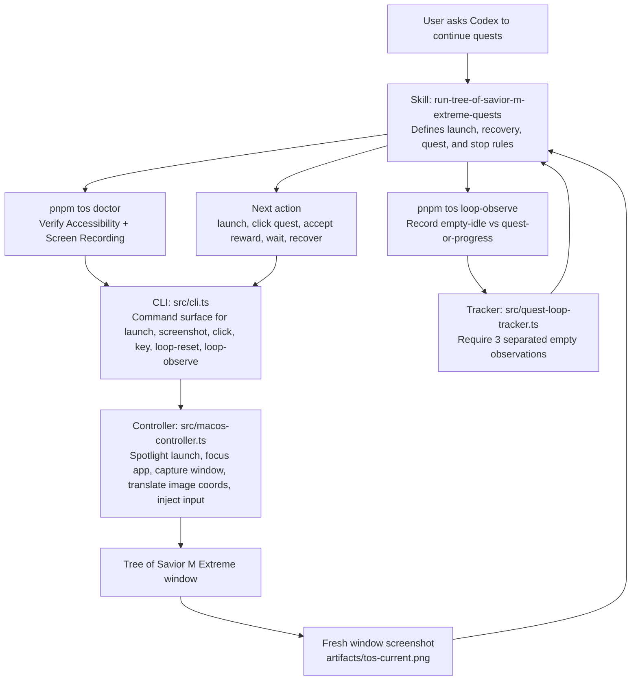

# Tree of Savior Extreme TH Mac App - AI workflow

Shared AI agent skills and harness configs for the Tree of Savior Extreme app workflow only.

## Stack

- Node.js 22
- pnpm
- ES modules
- `yargs` for the CLI
- `@inquirer/prompts` for interactive install selection

## Layout

- `skills/` - Codex skill source of truth
- `scripts/nemo.mjs` - interactive symlink installer

## Install

```bash
pnpm install
pnpm nemo symlink
```

The `nemo` command lets you choose whether to install:

- skills

Codex is available as both a project-local `.codex/skills` target and a global
`~/.codex/skills` target.
You can install into this project or into your home directory so the same skills are available across projects.

## Scope

This project only focuses on the Tree of Savior Extreme app and its related automation tasks.

Current skills:

- `launch-app-via-spotlight`
- `run-tree-of-savior-m-extreme-quests`

Each skill lives under `skills/<skill-name>/SKILL.md` and should stay specific to Tree of Savior Extreme use cases.

## Phase 1: Codex on macOS

The first phase targets the Codex desktop app and its Computer Use helper. Before
running the controller, open **System Settings > Privacy & Security** and enable
both `Codex` and `Codex Computer Use` in:

- **Accessibility** - allows keyboard and pointer control.
- **Screen & System Audio Recording** - allows screenshots and visual state
  detection. Older macOS versions may label this pane **Screen Recording**.

If Codex is running from a terminal, also enable both permissions for the host
terminal application, such as `Terminal` or `iTerm`. macOS applies these grants
to the application that launched the controller.

Quit and reopen Codex and its host terminal, when applicable, after changing
either permission so macOS applies the new grants to the running processes. Then
verify the setup from the repository root:

```bash
pnpm tos doctor
```

Continue only when the command reports both `"accessibility": true` and
`"screenRecording": true`.

## macOS Controller

The TypeScript controller provides the low-level interface used by the game loop:

```bash
pnpm tos launch
pnpm tos screenshot artifacts/tos-screen.png
pnpm tos click 640 420
pnpm tos window-screenshot artifacts/tos-window.png
pnpm tos window-click 640 420
pnpm tos key 36
pnpm tos doctor
pnpm test
```

`src/game-loop.ts` keeps visual state detection behind `GameAdapter`; the next
adapter can use screenshots or recorded UI events without changing the
quest-loop safety rules.

## Workflow

The repository is split into two layers:

- the Codex skill defines the gameplay policy and recovery rules
- the TypeScript CLI/controller provides the concrete macOS inputs, screenshots,
  and loop-state persistence that the skill relies on



In practice, the skill is the decision-maker and the controller is the
interface layer. The skill inspects each fresh game-window screenshot, chooses
the next action, invokes the CLI, then rechecks the result with another
screenshot. The quest loop only stops after `loop-observe` records three valid
empty idle states, which keeps the interface honest about whether quests are
actually exhausted.

## Loop Engineering Guide

This repository is also a practical example of **loop engineering**.

If you are new to the idea, loop engineering means building an agent or
automation around a repeated cycle:

1. observe the current state
2. decide the next action from that state
3. act once
4. verify the result with a fresh observation
5. repeat until a strict stop condition is satisfied

The important part is that the system does **not** assume one action solved the
task. It keeps checking reality after every step.

### Why This Matters

A lot of fragile automations fail because they follow a one-shot script:

1. click this
2. wait
3. click that
4. assume success

That approach breaks as soon as the app is slower than expected, opens a
different screen, disconnects, or shows an unexpected dialog.

Loop engineering is more reliable because it is built around:

- fresh observation instead of assumption
- state-based decisions instead of a fixed script
- explicit recovery rules instead of silent failure
- strict completion checks instead of guessing when the task is done

### The Core Pattern

Here is the simplest reusable form:

```text
initialize loop state

while not done:
    observe reality
    classify the current state

    if done-condition is truly met:
        confirm it enough times
        exit only after confirmation passes

    choose the highest-priority action for this state
    perform exactly one meaningful action
    observe again on the next loop
```

In this project, that pattern appears in both the skill instructions and the
TypeScript support code.

### How This Repo Implements It

The implementation is split across three layers:

- [skills/run-tree-of-savior-m-extreme-quests/SKILL.md](/Users/akkaponsomjai/personal/tos-mac-app-ai-workflow/skills/run-tree-of-savior-m-extreme-quests/SKILL.md) defines the policy: what to observe, what actions are allowed, how recovery works, and when the loop may stop.
- [src/game-loop.ts](/Users/akkaponsomjai/personal/tos-mac-app-ai-workflow/src/game-loop.ts) shows the loop as code: observe, map state to action, act, and continue until completion or a safety limit.
- [src/quest-loop-tracker.ts](/Users/akkaponsomjai/personal/tos-mac-app-ai-workflow/src/quest-loop-tracker.ts) enforces the stop condition: the loop is only complete after three separated empty observations.

That gives us a concrete observe-decide-act-verify system:

1. Observe
   The controller captures a fresh game-window screenshot.
2. Classify
   The skill or adapter labels the state such as `title`, `main-quest`,
   `quest-reward`, `loading`, or `quests-exhausted`.
3. Act
   The loop chooses one action such as `launch`, `advance-main-quest`,
   `accept-quest-reward`, or `wait`.
4. Verify
   The next loop iteration must use a fresh screenshot, not old coordinates or
   assumptions.
5. Stop safely
   The loop must see three consecutive valid empty states before reporting that
   quests are exhausted.

### The Five Design Rules

If you want to implement loop engineering in your own skill, these are the most
important rules to copy.

#### 1. Always Observe Fresh Reality

Never reuse stale screenshots, old coordinates, or a remembered UI state after
an action. This repo explicitly requires a fresh window screenshot after every
state-changing input.

Why it matters:

- the window can move
- the UI can change
- the last click may not have worked
- a new dialog may have appeared

#### 2. Use Explicit States

Do not write vague logic like "if game looks busy, wait."

Instead, define named states. This repo does that in
[src/game-loop.ts](/Users/akkaponsomjai/personal/tos-mac-app-ai-workflow/src/game-loop.ts)
with `GameState`, for example:

- `title`
- `barrack`
- `character-select`
- `main-quest`
- `sub-quest`
- `quest-reward`
- `quest-progressing`
- `loading`
- `disconnected`
- `quests-exhausted`

Named states make it easier to:

- reason about behavior
- test the loop
- add recovery logic
- explain the skill to other people

#### 3. Choose One Highest-Priority Action Per Loop

Each iteration should make one clear decision from the observed state.

This repo maps states to actions in `actionFor(...)` inside
[src/game-loop.ts](/Users/akkaponsomjai/personal/tos-mac-app-ai-workflow/src/game-loop.ts).
For example:

- `not-running` -> `launch`
- `quest-reward` -> `accept-quest-reward`
- `quest-dialogue` -> `wait`
- `objective-marker` -> `activate-objective`

That keeps the loop understandable and prevents chaotic multi-action branches.

#### 4. Build Recovery Into the Loop

Good loops do not treat interruptions as special cases outside the system.
They make recovery part of the system.

This repo treats states like `loading`, `disconnected`, and `unknown` as
recovery-aware states. It also tracks repeated recovery states so the loop can
report that it is stuck instead of pretending progress is happening.

That is an important loop-engineering idea:

- normal progress paths are explicit
- failure paths are also explicit
- both are handled inside the same control loop

#### 5. Make Completion Hard to Fake

The biggest beginner mistake is stopping too early.

This repo solves that with a confirmation rule in
[src/quest-loop-tracker.ts](/Users/akkaponsomjai/personal/tos-mac-app-ai-workflow/src/quest-loop-tracker.ts):

- one empty screen is not enough
- empty observations must be fresh
- empty observations must be separated by at least 5 seconds
- the loop only completes after 3 valid empty states

This is classic loop engineering. Completion is not a guess. It is a verified,
repeatable condition.

### A Reusable Template

You can adapt this pattern for any UI or agent workflow:

```text
reset confirmation counters

while true:
    observation = observe()
    state = classify(observation)

    if state is complete_candidate:
        record confirmation
        if confirmation threshold reached:
            return completed
        wait briefly
        continue

    clear completion confirmation

    if state is recovery_state:
        recover_or_retry()
        continue

    action = choose_action(state)
    act(action)
```

Use this when building skills for:

- game automation
- browser workflows
- desktop app control
- support agents
- operational runbooks
- any task where the environment can change between steps

### How To Explain It To Beginners

If you are teaching someone with no background knowledge, the easiest phrasing
is:

> Loop engineering means the agent keeps checking what is actually happening,
> takes one action, checks again, and only stops after repeated proof that the
> goal is finished.

That description is simple, accurate, and matches what this repository does.
